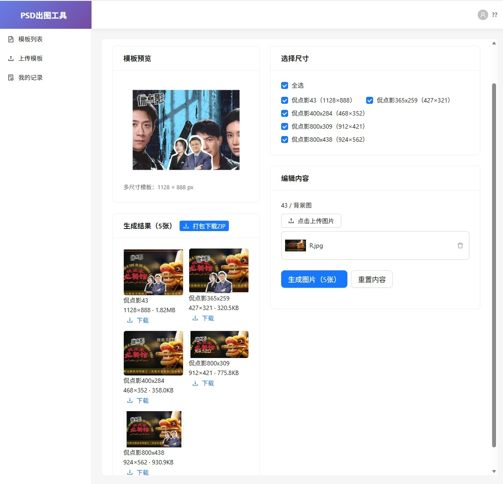

# 多尺寸模板设计文档

> 创建时间：2026-09-07
> 状态：已完成
> 所属迭代：v1.1

---

## 一、背景与目标

### 1.1 问题背景
运营场景中，同一个设计主题往往需要输出多个尺寸的图片（如公众号封面、小红书竖版、抖音横版、海报等）。如果每个尺寸都做一个独立模板，不仅维护成本高，而且每次改内容都要重复操作 N 次。

### 1.2 核心目标
- **一个模板，多个尺寸变体**：上传多个 PSD（每个尺寸一个），统一管理
- **一次编辑，批量生成**：用户填一次内容，同时生成所有选中尺寸的图片
- **打包下载**：多尺寸结果支持一键 ZIP 打包下载
- **向下兼容**：不破坏原有单尺寸模板的使用方式

---

## 二、方案选型

### 2.1 方案对比

| 方案 | 原理 | 优点 | 缺点 |
|------|------|------|------|
| 方案A：单PSD + sharp缩放裁切 | 上传 1 个 PSD，生成时用 sharp 缩放到不同尺寸 | 实现简单，只需 1 个 PSD | 横竖版比例差异大时裁切效果差，无法适应不同版式 |
| **方案B：多PSD多尺寸变体** | 每个尺寸上传 1 个独立 PSD，各有各的版式布局 | 每个尺寸都是独立设计，效果最好；支持完全不同的横竖版布局 | 需要设计多个 PSD，实现复杂度稍高 |

### 2.2 最终选择：方案B（多PSD多尺寸变体）

**选择理由**：
1. 不同尺寸的版式布局差异很大（横版 vs 竖版），不是简单缩放能解决的
2. 运营物料对排版要求高，每个尺寸独立设计才能保证效果
3. 虽然多做了几个 PSD，但生成效率和质量都更高

---

## 三、数据模型

### 3.1 Template 实体新增字段

```typescript
// 模板尺寸变体（一个模板对应多个 PSD）
interface SizeVariant {
  name: string           // 尺寸名称，如"公众号封面"、"小红书竖版"
  width: number          // 画布宽度
  height: number         // 画布高度
  psdUrl: string         // 该尺寸的 PSD 文件地址
  cover: string          // 该尺寸的预览图地址
  layers: Layer[]        // 该尺寸的图层数据（扁平化后）
}
```

Template 实体新增字段：
- `sizeVariants` (JSON 列)：尺寸变体数组

**兼容说明**：
- 旧模板（没有 sizeVariants 的）走旧的单尺寸生成逻辑（`generateImagesLegacy`）
- 新模板（有 sizeVariants 的）走多尺寸变体逻辑
- 列表页：有 sizeVariants 的模板显示「N 个尺寸」标签

### 3.2 图层匹配规则

不同 PSD 的图层通过 **匹配名** 进行关联：

```
匹配名 = 图层名去掉组名/尺寸前缀后的最后一段
```

示例：
- `800x438 / 背景图` → 匹配名：`背景图`
- `组名 / 子组 / 主标题` → 匹配名：`主标题`
- `主标题` → 匹配名：`主标题`

**匹配公式**：`图层类型:匹配名`

- `image:背景图` 匹配 `image:背景图` ✅
- `text:主标题` 匹配 `text:主标题` ✅
- `image:背景图` 不匹配 `text:背景图` ❌（类型不同）

**前后端统一**：
- 前端：`getLayerMatchName()` 函数（upload.tsx / use.tsx）
- 后端：`getLayerMatchName()` 方法（template.service.ts）
- 两端规则完全一致，保证数据互通

---

## 四、前端实现

### 4.1 上传页（upload.tsx）

**效果展示**：



**功能点**：
1. **多 PSD 上传**：拖拽区支持多选 PSD 文件，一次上传多个
2. **自动解析**：每个 PSD 独立解析，自动识别尺寸和图层
3. **尺寸管理**：
   - 自动用 PSD 文件名作为尺寸名称（可修改）
   - 显示尺寸宽高
   - 支持删除某个尺寸
4. **公共可编辑图层**：
   - 自动计算所有尺寸共有的可编辑图层（按匹配名+类型交集）
   - 表格形式展示，可勾选哪些图层允许用户编辑
   - 图层按匹配名合并显示，标注出现在几个尺寸中
5. **保存**：把 sizeVariants 数组传给后端

**关键函数**：
```typescript
// 提取匹配名
function getLayerMatchName(layer: { name: string }): string

// 计算跨尺寸图层匹配key
function getLayerKey(layer: { name: string; type: string }): string

// 更新公共可编辑图层
function updateCommonEditableLayers(allVariants: SizeVariant[]): CommonEditableLayer[]
```

### 4.2 使用页（use.tsx）

**功能点**：
1. **尺寸选择**：
   - 展示模板所有尺寸，Checkbox 多选
   - 默认全选
   - 全选/半选状态支持
   - 生成按钮显示选中数量
2. **编辑内容**：
   - 只显示所有尺寸共有的可编辑图层（交集）
   - 文字层：Form.Item + TextArea，绑定 Form
   - 图片层：独立 state 管理（imageValues + imageFileLists），不绑定 Form
   - 为什么图片层不绑 Form：Ant Design Upload 组件的值格式是 fileList 数组，和表单期待的字符串 url 不一致，容易出 bug
3. **生成结果**：
   - 网格展示所有尺寸的生成图
   - 每张图显示尺寸名、实际像素、文件大小
   - 支持单张下载
   - 多张时显示「打包下载 ZIP」按钮
4. **重置内容**：同时清空表单和图片状态

**关键状态**：
```typescript
const [imageValues, setImageValues] = useState<Record<string, string>>({})
const [imageFileLists, setImageFileLists] = useState<Record<string, any[]>>({})
```

---

## 五、后端实现

### 5.1 生成流程

```
前端请求 generate 接口
  ↓
检查模板有没有 sizeVariants
  ├─ 有 → 走多尺寸变体逻辑
  │     ↓
  │   筛选目标尺寸（根据 sizeNames 参数）
  │     ↓
  │   遍历每个尺寸变体
  │     ├─ 用 sizeVariant.layers 作为图层数据
  │     ├─ buildVariantReplaceContent 转换 replaceData（匹配名 → layerId）
  │     └─ imageRenderService.renderSingle 渲染单张
  │     ↓
  │   收集所有结果
  │     ↓
  │   超过 1 张 → 打包 ZIP
  │     ↓
  │   保存生成记录
  │     ↓
  │   返回结果
  └─ 无 → 走旧版逻辑（generateImagesLegacy）
```

### 5.2 关键方法

**TemplateService**：
- `generateImages()`：入口方法，判断走新逻辑还是旧逻辑
- `buildVariantReplaceContent()`：把前端传的「匹配名→替换数据」转换成「layerId→替换数据」
  - 先扁平化图层
  - 按匹配名建立索引
  - 遍历 replaceData，找到对应图层的 layerId
  - 找不到就跳过（该尺寸没有这个图层，不替换）
- `getLayerMatchName()`：提取图层匹配名（和前端规则一致）

**ImageRenderService**（修改点）：
- `compositeImageLayer()`：增加越界处理
  - sharp composite 不支持负坐标，也不允许合成图大于底图
  - PSD 图层经常有出血/越界
  - 解决方案：先计算可见区域，裁剪后再合成

### 5.3 接口

**POST /template/:id/generate**

请求体（新增 sizeNames 参数，保持向后兼容）：
```json
{
  "replaceData": {
    "背景图": { "type": "image", "url": "/uploads/xxx.jpg" },
    "主标题": { "type": "text", "content": "今日特价", "style": {...} }
  },
  "sizeNames": ["公众号封面", "小红书竖版"]
}
```

响应：
```json
{
  "code": 0,
  "data": {
    "images": [
      { "sizeName": "公众号封面", "width": 900, "height": 383, "url": "/uploads/render/xxx.png", "fileSize": 123456 },
      { "sizeName": "小红书竖版", "width": 1080, "height": 1440, "url": "/uploads/render/xxx.png", "fileSize": 234567 }
    ],
    "zipUrl": "/uploads/render/xxx_batch.zip",
    "recordId": 123
  }
}
```

---

## 六、兼容性

### 6.1 数据兼容
- 旧模板（无 sizeVariants）：走 `generateImagesLegacy`，完全不受影响
- 旧模板的 sizes 字段（仅存宽高）：继续保留，展示用
- 新模板：sizeVariants 存完整数据

### 6.2 接口兼容
- `generate` 接口新增 `sizeNames` 参数，不传就默认生成所有尺寸
- 旧的 replaceData 格式（key 为 layerId）在旧逻辑中继续使用
- 新逻辑中 replaceData 的 key 是匹配名

### 6.3 前端兼容
- 模板列表：有无 sizeVariants 都能正常显示
- 使用页：自动检测模板类型，渲染对应 UI

---

## 七、踩坑记录

> 详细的 Badcase 见迭代文档，这里只列和多尺寸相关的关键坑

### 坑1：图层名带尺寸前缀，跨尺寸匹配不上
- **现象**：上传多个 PSD 后，公共可编辑图层为空，使用页看不到可编辑项
- **原因**：PSD 里图层名是「800x438 / 背景图」这种格式，每个尺寸前缀不一样，完全匹配肯定匹配不上
- **解决**：用「最后一段名称」作为匹配名，去掉组名/尺寸前缀

### 坑2：图片替换不生效，replaceData 为空
- **现象**：上传了新背景图，生成后没变化，Network 看 replaceData 是空对象
- **原因**：Upload 组件绑在 Form 上，但 Upload 的值格式是 fileList，不是字符串 url
- **解决**：图片层用独立 state 管理，不依赖 Form 绑定

### 坑3：生成图片全白，图层越界
- **现象**：部分尺寸的生成图是全白的，只有几KB
- **原因**：sharp composite 不支持负坐标和超出画布的合成图，越界就报错，catch 后返回底图（白色）
- **解决**：合成前先计算可见区域，裁剪到画布范围内再合成

---

## 八、后续优化方向

1. **性能优化**：多尺寸批量生成改成并发（目前是串行），提升生成速度
2. **尺寸预设库**：常用尺寸一键添加（公众号、小红书、抖音等），手动输入减少
3. **尺寸分组**：模板多尺寸太多时，按横版/竖版/正方形分组展示
4. **预览切换**：使用页的模板预览支持切换不同尺寸的预览图
5. **单尺寸编辑**：支持某个尺寸单独调整内容（不完全共用）
