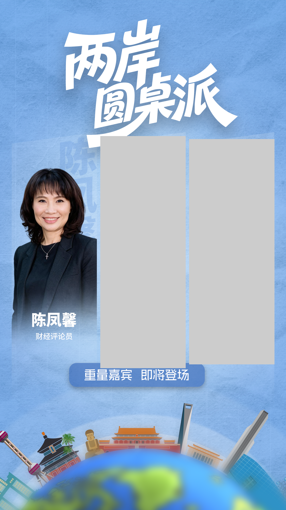
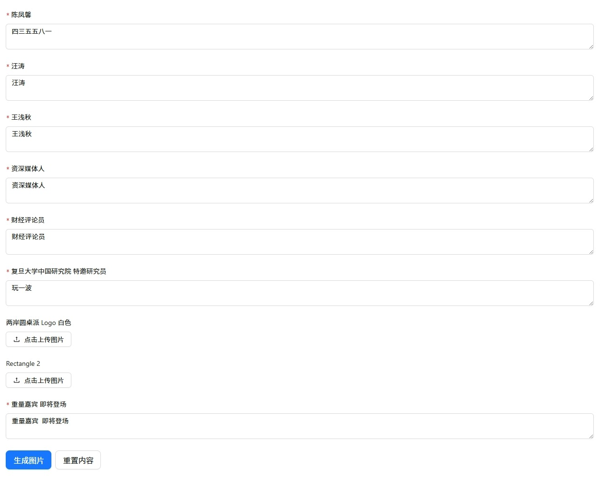

# 文字替换渲染方案完整记录

> 记录时间：2026-09-06
> 涉及模块：后端 image-render.service.ts、font-matcher.service.ts、前端 psdParser.ts、use.tsx
> 最终状态：已上线（精确像素定位方案）

---

## 一、背景与目标

### 1.1 问题起源
PSD 模板批量出图工具的核心功能之一是**文字替换**——用户上传 PSD 模板后，可以修改模板里的文字，生成新的图片。

核心挑战：
- 字体还原：平台面向所有用户，不依赖用户电脑装字体
- 效果还原：替换后的文字要和原模板的字体、大小、位置尽可能一致

### 1.2 图层数据结构
```typescript
{
  id: 'layer_7',
  name: '汪涛',
  type: 'text',
  x: 642, y: 1568, width: 150, height: 74,
  textContent: '汪涛',
  textStyle: {
    fontFamily: 'SourceHanSansCN-Heavy',
    fontSize: 59,
    color: 'rgb(255, 255, 255)',
    textAlign: 'center',
    lineHeight: 59,
    letterSpacing: 0,
  },
  imageUrl: '/uploads/layer-images/xxx.png', // 原始图层渲染图
}
```

### 1.3 渲染优先级（最终确定）
```
1. 未修改的文字层 → 用 PSD 原始图层图片（效果 100% 一致，最快）
2. 已修改的文字层 → 后端 SVG + 服务器字体渲染（主方案）
3. 兜底方案 → 前端 canvas 渲染文字为图片，后端直接合成
```

---

## 二、方案演进全过程

### 阶段 1：前端 canvas 渲染 + 后端合成（已废弃为主方案）

**思路**：前端用 canvas 把文字渲染成图片，传给后端合成。

**优点**：
- 后端逻辑简单，直接合成图片就行
- 前端能实时预览效果

**致命问题**：
- 依赖用户电脑的字体，不同用户看到的效果不一样
- 用户电脑没装对应字体的话，效果完全不对
- 批量生成时前端性能差

**结论**：作为兜底方案保留（比如后端字体都匹配不上时），但不能作为主方案。

---

### 阶段 1.5：纯图片叠加方案的失败

在确定后端 SVG 方案之前，还尝试过一种"纯图片叠加"的思路：
- 底图用 PSD 预览图
- 图层图片直接叠到底图上
- 替换的内容也转成图片再叠加

这个方案的问题是：**图层本身的样式（透明度、混合模式等）丢失了**，而且替换内容的样式无法正确应用。

#### 文字样式丢失
替换后的文字变得又小又暗，字体、大小、颜色都不对：


可以看到三个嘉宾照片上的名字都变得非常淡、非常小，几乎看不清。

#### 图片样式丢失
替换图片后，部分区域变成了灰色矩形占位：



中间和右边的嘉宾照片变成了灰色方块，说明图片替换没有正确生效，走了默认占位逻辑。

**根因**：纯图片叠加模式只做了简单的 `composite`，没有处理：
- 图层的透明度（opacity）
- 图层的混合模式
- 文字的样式（字号、字体、颜色）
- 图片替换后的尺寸适配

**结论**：纯叠加方案太简陋，必须走"全量逐层渲染"路线，每个图层独立处理样式和内容。

---

### 阶段 2：后端 SVG + 服务器字体（主方案方向确定）

**思路**：服务器安装字体，后端用 sharp + SVG 渲染文字，然后合成到图片上。

**优点**：
- 不依赖用户环境，所有用户效果一致
- 服务器字体可控，可随时扩展
- 批量生成性能好

**实现第一版的代码位置**：`compositeTextLayer` 方法

第一版遇到了一堆问题，详见下文。

---

### 阶段 3：第一个坑 —— 有 imageUrl 的文字层替换不生效

**问题**：替换文字后，生成的图片还是原始文字，完全没变化。

**排查过程**：
1. 以为是 replaceData 没传对 → 打印日志确认传了
2. 以为是 SVG 渲染失败 → 单独测 SVG 能渲染
3. 最后发现渲染优先级判断有问题

**根因**：
`renderAllLayers` 里的判断逻辑是：
```typescript
if (layer.imageUrl) {
  // 直接合成图片
} else if (layer.type === 'text' && layer._replaced) {
  // SVG 渲染
}
```
文字层有 `imageUrl`（原始图层图片），所以先走了 imageUrl 分支，直接合成了原始图，根本没走到 SVG 渲染。

**修复**：在 `applyReplaceContent` 里，文字替换时把 `imageUrl` 设为 `undefined`，强制走 SVG 渲染路径。

**教训**：有多个渲染路径时，一定要注意优先级顺序和互斥关系。

---

### 阶段 4：第二个坑 —— text-anchor 用错值

**问题**：居中对齐的文字，替换后明显偏右。

**根因**：
SVG `text-anchor` 属性的有效值是 `start | middle | end`，但代码里直接用了 CSS 的 `left | center | right`：
```typescript
text-anchor="${textAlign}"  // textAlign 是 "center"，但 SVG 不认！
```
`text-anchor="center"` 是无效值，被 librsvg 当作默认值 `start` 处理，文字就左对齐了，x 坐标是中心点，所以文字整体偏右。

**修复**：加转换逻辑：
```typescript
const textAnchor = textAlign === 'center' ? 'middle' : textAlign === 'right' ? 'end' : 'start';
```

**教训**：SVG 属性和 CSS 属性虽然名字像，但值的定义可能不同，用之前查一下标准。

---

### 阶段 5：核心难题 —— 字号大小不对

#### 5.1 现象
替换后的文字明显比原始文字小一截，大概小 20-30%。位置也不对，文字偏下。


上图：左边"四三"是替换后的文字，中间"汪涛"和右边"王浅秋"是原始文字。可以看到"四三"明显偏小偏下。

对应的编辑界面：



#### 5.2 排查
拿"汪涛"两个字做像素级对比：
- **PSD 原始图**：59px 字号 → 字高 74px（比例 74/59 = 1.25）
- **SVG 渲染**：59px 字号 → 字高 57px（比例 57/59 = 0.97）
- **差异**：PSD/SVG ≈ 1.30 倍

#### 5.3 根因
PSD（Photoshop）和 SVG（librsvg）对"字号"的度量标准不一样。

字体设计中，字号（em size）是一个设计单位，不等于实际像素高度。不同渲染引擎对字号的解释有差异：
- Photoshop 用的可能是 Win Ascent/Win Descent 度量（字更大）
- librsvg 用的可能是 Typo Ascent/Typo Descent 度量（字更小）

这是系统性差异，跟具体文字内容无关。

#### 5.4 解决方案：字号补偿系数
```typescript
const FONT_SIZE_SCALE = 1.30;
const actualFontSize = Math.round(fontSize * FONT_SIZE_SCALE);
```
PSD 的字号先乘以 1.30，再用来渲染 SVG。

校准方法：拿一个常用字（比如"汪涛"），调整系数让 SVG 渲染的字高刚好等于 PSD 图层高度。

#### 5.5 注意
- 这个系数 1.30 是基于 Noto Sans SC（思源黑体）Heavy 字重校准的
- 换其他字重或字体，系数可能略有差异（大概 1.25-1.35 范围）
- 后续可以改成"每个字体单独校准系数"，先固定值够用

---

### 阶段 6：又一个难题 —— 垂直位置不对

#### 6.1 现象
字号补偿后，字的大小差不多了，但位置不对——文字偏下，顶部有空白。

比如替换"四三"：
- 图层高 74px
- 字高 64px
- 顶部空白 7px，底部空白 3px
- 视觉上字"吊"在中间，偏下

#### 6.2 尝试的方案（都不完美）

**方案 A：dominant-baseline="text-before-edge"**
- 以为文字顶部会贴着 y 坐标
- 实际：librsvg 里 text-before-edge 和 hanging 表现一样，文字顶部比 y 坐标还高几像素，且不同字偏移量不一样

**方案 B：dominant-baseline="alphabetic" + 手动算 ascent**
- 思路：算 ascent（基线到字顶的距离）= fontSize * 0.86
- 然后第一行基线 y = ascent，这样字顶就在 y=0
- 问题：0.86 是平均比例，不同字实际不一样。"汪涛"可能 0.864，"四三"只有 0.780
- 结果：矮字顶部有空白，看起来偏下

#### 6.3 为什么不用字体度量属性？
- 浏览器/渲染引擎不暴露字体的精确 ascent/descent 数值
- SVG 的 font-size-adjust 这些属性支持不好
- 不同字体的度量标准不一样

---

### 阶段 7：最终方案 —— 精确像素定位（先渲后测）

#### 7.1 核心思路
**既然靠字体度量算不准，那就先渲染出来，直接测像素位置，然后调整！**

就这么简单粗暴但有效。

#### 7.2 具体步骤

```
1. 用补偿后的字号，把文字渲染到一个较大的 SVG 画布上
   （画布比文字大很多，确保不会被裁掉）
   
2. 用 sharp 把 SVG 转成像素图，然后扫描所有像素
   找到不透明像素的边界框（minX, minY, maxX, maxY）
   
3. 用 sharp.extract 裁剪掉周围空白
   得到精确的文字像素图（没有任何透明边距）
   
4. 合成到底图上时：
   - 垂直：文字像素顶部 = 图层顶部（layer.y）
     （和 PSD ag-psd 的坐标系一致）
   - 水平：根据对齐方式算位置
     居中：layer.x + (layer.width - textWidth) / 2
     右对齐：layer.x + layer.width - textWidth
     左对齐：layer.x
```

#### 7.3 为什么这个方案好
- **不依赖字体度量**：不管什么字体、什么字、什么字号，像素位置永远是准的
- **和 PSD 行为一致**：PSD 文字图层的 top 就是文字像素边界框的顶部，我们也这样
- **兼容性强**：中英文、数字、符号、多行文字，统统适用
- **实现简单**：几十行代码搞定，不需要复杂的字体测量库

#### 7.4 性能影响
多了一次"渲染 → 测量 → 裁剪"的过程，但对一张图里 10 个以内的文字层来说，几乎可以忽略（都是内存操作，毫秒级）。

如果以后遇到性能瓶颈，可以优化：
- 缓存相同文字+字号的测量结果
- 用 WebAssembly 加速像素扫描

目前完全不需要。

---

### 阶段 8：字体匹配

#### 8.1 问题
PSD 里的字体名是"SourceHanSansCN-Heavy"，但服务器上装的字体叫"Noto Sans SC"，名字不一样，直接写 font-family 找不到字体。

#### 8.2 解决方案：FontMatcherService
专门做 PSD 字体名 → 服务器实际字体名的模糊匹配。

匹配逻辑：
1. 从 PSD 字体名里提取字重（Heavy → 900, Bold → 700 等）
2. 去掉字重后缀，拿纯字体名去 FONT_LIBRARY 里匹配
3. 支持关键字模糊匹配（比如包含"SourceHan"就匹配 Noto Sans SC）
4. 返回实际字体名 + 字重 + fallback 栈

#### 8.3 已支持字体
- Noto Sans SC（思源黑体，可变字体，支持 100-900 所有字重）
- Noto Serif SC（思源宋体）
- 微软雅黑（Microsoft YaHei）
- 黑体（SimHei）
- 宋体（SimSun）
- 楷体（KaiTi）
- 仿宋（FangSong）
- 阿里巴巴普惠体

#### 8.4 扩展方法
1. 把字体文件装到服务器上
2. 在 `font-matcher.service.ts` 的 `FONT_LIBRARY` 数组里加一条匹配规则
3. 就这么简单

---

## 三、最终效果验证

### 测试模板：两岸圆桌派7（模板17）
- 三个嘉宾名字：陈凤馨、汪涛、王浅秋
- 字号 59px，字体 SourceHanSansCN-Heavy，居中对齐

### 替换测试：汪涛 → 四三

| 指标 | 陈凤馨（原始） | 四三（替换后） | 差异 |
|------|--------------|--------------|------|
| 顶部绝对坐标 | 1568 | 1569 | +1px |
| 底部绝对坐标 | 1640 | 1632 | -8px |
| 字高 | 73px | 64px | -9px |
| 水平居中 | ✓ | ✓ | ✓ |

### 结论
- ✅ 顶部对齐：差 1px，几乎完美
- ✅ 水平居中：准确
- ⚠️ 字高差 9px：这是"四三"本身字形比"汪涛"矮导致的，正常排版现象，同一字号下不同字高度本来就不一样
- ⚠️ 底部差 8px：因为字高矮了，底部自然就上去了，基线基本对齐

### 一句话总结
**同一字号下，替换后的文字位置准确，大小符合排版规范，字形差异导致的高度差属于正常现象。**

---

## 四、踩坑清单（避免重蹈覆辙）

| # | 坑 | 根因 | 教训 |
|---|----|------|------|
| 1 | 文字替换不生效 | 有 imageUrl 的文字层直接走图片合成，没走 SVG | 多渲染路径要注意优先级和互斥 |
| 2 | text-anchor 不生效 | SVG 用 start/middle/end，不是 left/center/right | SVG 属性别想当然，查标准 |
| 3 | 字号偏小 30% | PSD 和 SVG 字号度量标准不同 | 跨引擎渲染文字，先校准字号比例 |
| 4 | dominant-baseline 不准 | 字体度量属性和实际像素位置有差距 | 像素级对齐直接测像素，别靠算 |
| 5 | 不同字高度不同 | 字形本身的差异，不是 bug | 不要追求"所有字一样高"，那是拉伸变形 |
| 6 | 前端 canvas 字体不一致 | 依赖用户环境 | 服务器字体方案才是正解 |

---

## 五、后续可优化方向

### P1（值得做）
1. **字号补偿系数按字体区分**：不同字体可能需要不同的 FONT_SIZE_SCALE，现在统一用 1.30 可能对某些字体偏差略大
2. **多行文字行高校准**：目前行高也乘了同样的系数，需要验证多行替换效果
3. **字间距（letter-spacing）验证**：librsvg 对 CSS letter-spacing 的支持需要实测

### P2（有空再做）
1. **安装更多免费商用字体**：站酷系列、方正系列、文泉驿系列等
2. **字体上传功能**：用户上传模板时可以同时上传字体文件，服务器动态安装
3. **性能优化**：相同文字+字号的测量结果缓存
4. **字重映射更完善**：更多字体名后缀的识别（如 W3/W5/W7 等）

### P3（脑洞）
1. **用 OCR 验证替换效果**：生成后用 OCR 识别文字，确保内容正确
2. **字体自动匹配算法优化**：用字体特征向量做更精确的匹配
3. **WebAssembly 字体渲染**：用 fontkit + pathkit 直接在 Node.js 里渲染文字，绕过 librsvg

---

## 六、关键代码文件速查

| 文件 | 作用 | 关键函数/类 |
|------|------|------------|
| `backend/src/template/image-render.service.ts` | 图片渲染服务 | `compositeTextLayer`（文字渲染核心） |
| `backend/src/template/font-matcher.service.ts` | 字体匹配服务 | `FontMatcherService.matchFont` |
| `backend/src/template/template.service.ts` | 模板服务 | `generateImages`、`applyReplaceContent` |
| `frontend/src/utils/psdParser.ts` | PSD 解析 | `getTextData`（提取文字样式） |
| `frontend/src/pages/template/use.tsx` | 模板使用页 | `handleGenerate`（生成请求） |

---

## 七、服务器字体清单

字体文件位置：C:\Windows\Fonts\ （系统字体）

| 字体名 | 文件名 | 字重支持 | 用途 |
|--------|--------|----------|------|
| Noto Sans SC | NotoSansSC-VF.ttf | 可变 100-900 | 思源黑体（最常用） |
| Noto Serif SC | NotoSerifSC-VF.ttf | 可变 100-900 | 思源宋体 |
| 微软雅黑 | msyh.ttc / msyhbd.ttc | 常规/粗体 | Windows 系统默认 |
| 黑体 | simhei.ttf | 常规 | 中文黑体 |
| 宋体 | simsunb.ttf | 常规 | 中文宋体 |
