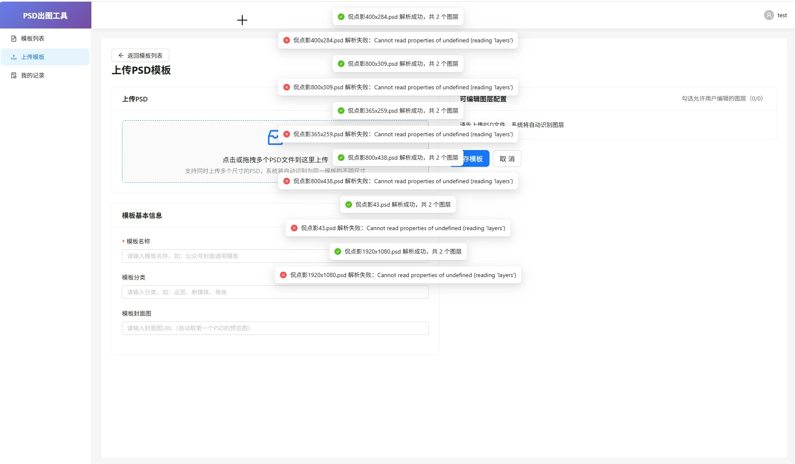
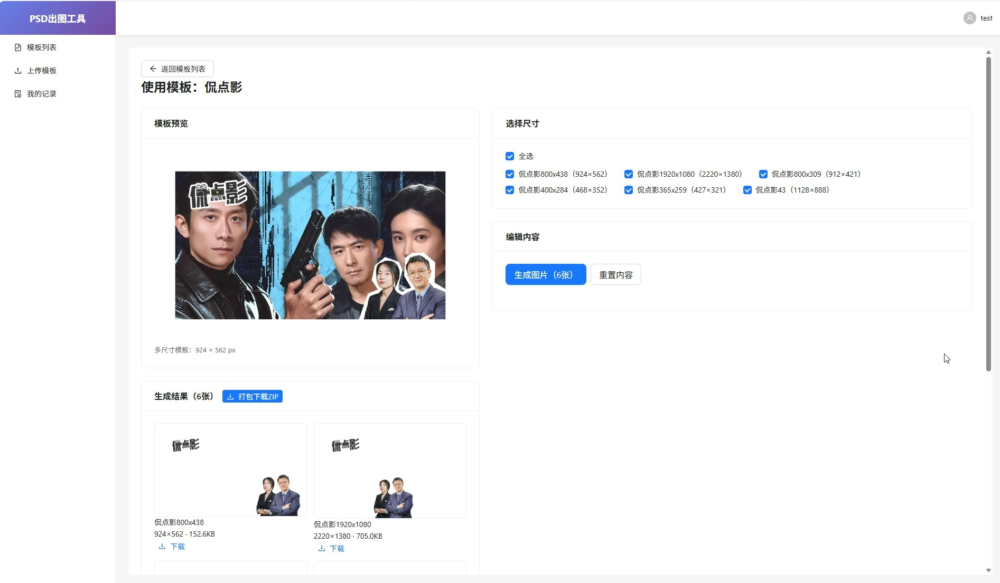
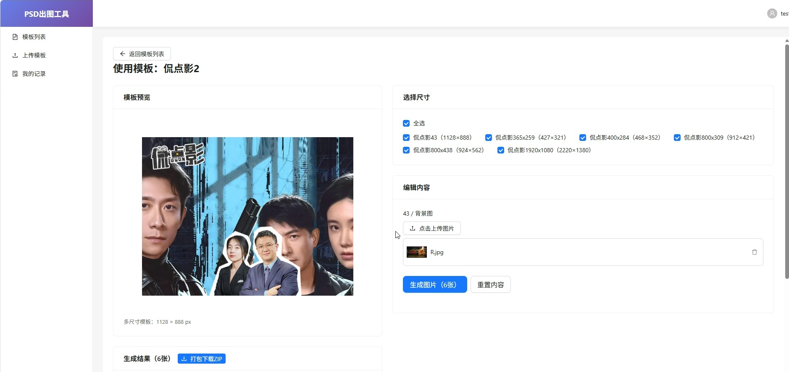
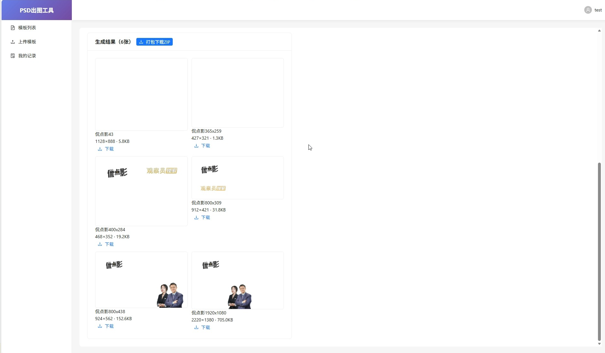

# 【v1.1】数据库接入 & 自研真实出图

> 迭代周期：2026-09-02 ~ 待定
> 负责人：妈咪
> 当前状态：进行中

---

## 一、迭代背景

**为什么做这个迭代？**
- 业务背景：v1.0 MVP 已完成核心流程，但 PSD 解析和图片渲染都是 Mock 模拟，无法真实出图；数据存在内存中，重启就丢
- 问题痛点：
  1. 没有数据库，所有数据都是临时的，服务重启就没了
  2. PSD 解析是假的，上传什么文件都返回固定图层
  3. 图片生成是假的，用 picsum 占位图，替换内容完全不生效
  4. 没有收藏、生成记录等用户沉淀功能
- 驱动来源：产品核心能力补齐（技术驱动）
- 调整说明：原计划对接 MCP 插件，但暂无可用 MCP 服务，改为自研方案实现真实出图

---

## 二、迭代目标

**可量化的结果指标：**
- [x] 目标1：数据持久化（验收标准：接入 MySQL，服务重启数据不丢失）
- [x] 目标2：真实 PSD 解析（验收标准：上传 PSD 后能正确识别文字层和图片层，标准图层准确率 90%+）
- [x] 目标3：真实图片渲染（验收标准：替换文字/图片后能生成对应尺寸的真实图片，渲染时间 < 10s/张）
- [x] 目标4：模板收藏功能（验收标准：用户可收藏/取消收藏模板，收藏列表可查看）
- [x] 目标5：生成记录管理（验收标准：每次生成记录保存，可查看历史记录和重新下载）

---

## 三、范围界定

### ✅ 本期做什么
- MySQL 数据库接入（替换 Mock 数据）
- TypeORM 实体完善 + 数据库迁移
- 基于 psd.js 的真实 PSD 解析
- 基于 sharp + node-canvas 的真实图片渲染
- 模板收藏功能（前后端）
- 生成记录管理（前后端）
- 本地上传文件存储（先不接 OSS）

### ❌ 本期不做什么
- MCP 插件对接（暂无可用服务，后续有了再做）
- OSS 对象存储（先用本地存储过渡）
- 在线画布编辑（v2.0）
- 团队协作功能（v2.0）
- 模板市场（v2.0）
- 付费会员体系（v2.0）

---

## 四、任务拆解

| 任务ID | 任务描述 | 负责人 | 优先级 | 预估工时 | 状态 |
|--------|----------|--------|--------|----------|------|
| T-001 | MySQL 数据库接入 + TypeORM 配置 |  | P0 |  | ✅ 完成 |
| T-002 | 用户表、模板表、收藏表、生成记录表实体完善 |  | P0 |  | ✅ 完成 |
| T-003 | 模板模块数据层从 Mock 切换到数据库 |  | P0 |  | ✅ 完成 |
| T-004 | 用户模块数据层从 Mock 切换到数据库 |  | P0 |  | ✅ 完成 |
| T-005 | psd.js 真实 PSD 解析接入 |  | P0 |  | ✅ 完成 |
| T-006 | sharp 真实图片渲染（SVG文字合成） |  | P0 |  | ✅ 完成 |
| T-007 | 模板收藏功能（前后端） |  | P1 |  | ✅ 完成 |
| T-008 | 生成记录管理（前后端） |  | P1 |  | ✅ 完成 |
| T-009 | 本地上传文件存储 |  | P1 |  | ✅ 完成 |
| T-010 | 预设尺寸库 |  | P2 |  | ✅ 完成（上传页已加） |
| T-011 | 换 ag-psd 实现真实 PSD 解析（替换 psd.js） |  | P0 |  | ✅ 完成 |
| T-012 | 去掉绑定生成尺寸，简化为一模板一尺寸 |  | P0 |  | ✅ 完成 |
| T-013 | 使用模板页改成真实数据动态渲染 |  | P0 |  | ✅ 完成 |
| T-014 | 全流程联调测试 |  | P0 |  | ✅ 完成 |
| T-015 | 渲染方案从底图模式改为全量逐层渲染 |  | P0 |  | ✅ 完成 |
| T-016 | 修复全量渲染的 opacity 单位错误和图层顺序问题 |  | P0 |  | ✅ 完成 |
| T-017 | 优化文字层渲染：未修改的文字用原始图层图片，保持 PSD 效果一致 |  | P0 |  | ✅ 完成 |
| T-018 | 后端 SVG 文字渲染方案（服务器装字体+SVG渲染，主方案）+ 前端 canvas 兜底 |  | P0 |  | ✅ 完成 |
| T-019 | 修复 psdParser 文字层不导出 imageData 的 bug |  | P0 |  | ✅ 完成 |
| T-020 | 优化 use.tsx：只对修改过的文字层做 canvas 重绘，未修改的用原始图片 |  | P0 |  | ✅ 完成 |
| T-021 | 后端 SVG 文字渲染位置大小修复（字号补偿+精确像素定位） |  | P0 |  | ✅ 完成 |
| T-022 | 字体匹配服务（PSD字体名→服务器实际字体的模糊匹配） |  | P0 |  | ✅ 完成 |
| T-023 | 模板多尺寸支持（上传页配置 + 使用页选择 + 批量生成 + ZIP打包） |  | P1 |  | ✅ 完成 |
| T-024 | 重构为多PSD多尺寸方案（一个模板多个PSD，各尺寸独立设计） |  | P0 |  | ✅ 完成 |

---

## 五、技术方案

### 关键技术决策

1. **PSD 解析方案**
   - 方案A：后端用 psd.js 解析（Node.js 环境）
   - 方案B：前端用 psd.js 解析后上传结果
   - **最终选择**：后端解析（方案A）
   - **选择理由**：前端解析依赖浏览器环境，兼容性差；后端解析可复用，且能直接存储结果

2. **图片渲染方案**
   - 方案A：sharp + node-canvas 后端渲染
   - 方案B：前端 canvas 渲染后上传
   - **最终选择**：后端渲染（方案A）
   - **选择理由**：批量生成时前端性能差，后端渲染可异步处理，且能直接生成文件

3. **文件存储方案**
   - 方案A：本地存储（v1.1）
   - 方案B：OSS 对象存储（v1.2）
   - **最终选择**：先本地存储，后续可无缝切换 OSS
   - **选择理由**：降低启动门槛，抽象存储层后切换成本低

### 架构调整
- 新增 database 配置层（TypeORM）
- 新增 storage 服务层（抽象文件存储接口）
- 新增 mcp/psd 服务层（PSD 解析逻辑）
- 新增 mcp/render 服务层（图片渲染逻辑）
- 新增收藏表、生成记录表实体

### 依赖项
- 外部依赖：MySQL、psd.js、sharp、node-canvas
- 内部依赖：用户体系、模板管理

### 文字渲染方案（最终版）

**渲染优先级**（从高到低）：
1. **未修改的文字层** → 用 PSD 原始图层图片（效果 100% 一致，最快）
2. **已修改的文字层** → 后端 SVG + 服务器字体渲染（主方案）
3. **兜底方案** → 前端 canvas 渲染文字为图片，后端直接合成

**后端 SVG 渲染关键技术点**：
- 字号补偿：PSD 字号 × 1.30（补偿 PSD 和 SVG 字号度量差异）
- 字体匹配：FontMatcherService 模糊匹配 PSD 字体名 → 服务器实际字体，带 fallback 栈
- 精确像素定位：先渲后测，裁剪空白，像素顶部对齐图层顶部（和 ag-psd 坐标系一致）
- text-anchor 转换：left/center/right → start/middle/end（SVG 标准值）

---

## 六、风险预判

| 风险点 | 影响程度 | 发生概率 | 应对预案 |
|--------|----------|----------|----------|
| node-canvas Windows 安装失败 | 高 | 高 | 用纯 sharp 方案兜底，或用 prebuilt 版本 |
| psd.js 解析复杂 PSD 不准确 | 中 | 高 | 先支持标准文字层和图片层，复杂图层后续优化 |
| 图片渲染速度慢 | 中 | 中 | 异步队列处理，前端显示进度条 |
| MySQL 环境配置问题 | 中 | 中 | 提供 docker-compose 一键启动 |

---

## 七、验收标准

### 功能验收
- [x] 服务重启后数据不丢失
- [x] 上传真实 PSD 能解析出文字层和图片层
- [x] 替换文字后生成的图片文字正确变化
- [x] 替换图片后生成的图片正确替换
- [x] 单尺寸生成可用（一模板一尺寸）
- [x] 多尺寸批量生成 + ZIP打包下载
- [x] 多PSD多尺寸方案（一个模板多个PSD，各尺寸独立设计）
- [x] 模板收藏/取消收藏正常
- [x] 生成记录可查看、可重新下载

### 性能验收
- [ ] PSD 解析时间 < 5s（10MB 以内标准 PSD）
- [ ] 单张图片渲染 < 10s
- [ ] 批量生成 5 张 < 30s

### 质量验收
- [ ] 无 P0/P1 bug
- [ ] 核心流程测试通过

---

## 八、里程碑

| 节点 | 计划时间 | 实际时间 | 状态 |
|------|----------|----------|------|
| 数据库接入完成 | 2026-09-02 | 2026-09-02 | ✅ 完成 |
| PSD解析接入完成 | 2026-09-02 | 2026-09-02 | ✅ 完成 |
| 图片渲染接入完成 | 2026-09-02 | 2026-09-02 | ✅ 完成 |
| 收藏+记录功能完成 | 2026-09-02 | 2026-09-02 | ✅ 完成 |
| ag-psd PSD解析替换完成 | 2026-09-02 | 2026-09-02 | ✅ 完成 |
| 模板尺寸简化（一模板一尺寸） | 2026-09-02 | 2026-09-02 | ✅ 完成 |
| 使用模板页动态渲染完成 | 2026-09-02 | 2026-09-02 | ✅ 完成 |
| 全流程联调完成 |  | 2026-09-03 | ✅ 完成 |
| 模板多尺寸功能完成 |  | 2026-09-06 | ✅ 完成 |
| 多PSD多尺寸方案重构完成 |  | 2026-09-06 | ✅ 完成 |
| 上线 |  |  | 未开始 |

---

## 九、Badcase 记录

> 格式：【日期】问题描述 → 根因分析 → 解决方案 → 预防措施

### 【2026-09-02】node-canvas Windows 环境安装失败
- **问题**：node-canvas 在 Windows 上缺少原生二进制文件，启动报错
- **根因**：canvas 需要系统级编译环境（node-gyp + Visual Studio），Windows 默认没有
- **解决方案**：改用纯 sharp + SVG 文字合成方案，不依赖 canvas
- **预防措施**：选型时优先考虑纯 JS 或预编译好的原生模块

### 【2026-09-02】sharp 0.35 版本颜色格式变更
- **问题**：sharp 的 create.background 用 `{r,g,b,a}` 对象格式导致进程直接崩溃
- **根因**：sharp 0.35+ 版本 API 变更，颜色参数改用字符串格式
- **解决方案**：所有颜色参数改用字符串（如 'white'、'#cccccc'）
- **预防措施**：升级依赖前先查 changelog，注意破坏性变更

### 【2026-09-02】sharp ESM 默认导出在 CommonJS 环境报错
- **问题**：`import sharp from 'sharp'` 编译后运行报 "is not a function"
- **根因**：sharp 新版是 ESM 包，TypeScript 编译成 CommonJS 后默认导出结构不对
- **解决方案**：改用 `const sharp = require('sharp')` 方式导入
- **预防措施**：Node.js 项目注意 ESM/CJS 兼容性问题

### 【2026-09-02】模板表 userId 外键约束导致创建失败
- **问题**：创建模板时报外键约束错误
- **根因**：模板实体定义了 ManyToOne 关联用户表，但用户模块和模板模块分离，且用户 ID 不匹配
- **解决方案**：移除所有实体的外键关联，只用字段关联（userId、templateId）
- **预防措施**：微服务/模块分离架构下，慎用外键约束，用应用层保证数据一致性

### 【2026-09-02】注册用户 ID 用 Date.now() 导致超出 MySQL int 范围
- **问题**：auth 模块 Mock 数据用 Date.now() 当用户 ID（13位数字），超出 MySQL int 范围
- **根因**：auth 模块还是 Mock 实现，没接数据库，ID 生成方式不对
- **解决方案**：auth 模块切换到真实数据库，用自增主键
- **预防措施**：Mock 数据也要考虑真实数据类型约束

### 【2026-09-02】psd.js 解析真实 PSD 导致后端进程直接崩溃
- **问题**：上传真实 PSD 文件时，后端进程直接退出，无错误日志
- **根因**：psd.js 库较老，Node.js 环境下原生解析有内存/崩溃问题
- **解决方案**：暂时注释掉 psd.js 解析，返回 Mock 数据；后续换 ag-psd 库
- **预防措施**：引入原生依赖前先做稳定性测试

### 【2026-09-02】前端上传组件 action 相对路径导致 404
- **问题**：上传 PSD 一直失败，后端收不到请求
- **根因**：Upload 组件的 action 写的是相对路径 `/api/template/upload`，请求发到了前端 5173 端口，而不是后端 3002
- **解决方案**：改用 customRequest 自定义上传，用项目统一的 request 工具
- **预防措施**：跨端口/跨域场景下，统一用项目的 request 工具发请求，不要用组件自带的 action

### 【2026-09-02】后端服务频繁崩溃退出，无错误日志
- **问题**：后端服务启动后，收到某些请求直接崩溃退出，异常过滤器也捕获不到
- **根因**：原生模块（psd.js / sharp）导致的底层崩溃，Node.js 异常机制捕获不到
- **解决方案**：排查并替换不稳定的原生依赖
- **预防措施**：关键路径加进程守护（PM2），原生依赖充分测试后再上线

### 【2026-09-02】MySQL JSON 列不能设置默认值
- **问题**：保存模板时报错 "Invalid default value for 'sizes'"
- **根因**：MySQL JSON 类型不支持 DEFAULT 约束，TypeORM synchronize 生成的 SQL 不兼容
- **解决方案**：移除实体 JSON 列的 default 配置，在 service 层手动赋值空数组
- **预防措施**：MySQL JSON 列不要设默认值，用代码层保证初始值

### 【2026-09-02】使用模板页加载失败（request 多取一层 data）
- **问题**：使用模板页提示"加载模板详情失败"
- **根因**：request 拦截器已经把后端响应的 data 字段返回了，但前端又多取了一层 res.data，导致拿到 undefined
- **解决方案**：前端直接使用返回值，不再多取一层 data
- **预防措施**：统一 request 封装规范，明确返回值结构

### 【2026-09-02】生成结果图片加载失败（相对路径无后端地址）
- **问题**：生成结果图片裂开，显示不出来
- **根因**：后端返回的图片 URL 是相对路径（/uploads/render/xxx.png），前端访问时去了 5173 端口，找不到图片
- **解决方案**：新增 getImageUrl 工具函数，统一给相对路径加上后端地址前缀
- **预防措施**：所有静态资源 URL 统一通过工具函数处理，确保跨端口场景正常

### 【2026-09-02】生成图片全白，文字渲染不出来
- **问题**：点击生成后，图片是全白的，下载也是空白图
- **根因**：无底图模式下，白色文字在白色背景上看不见；且图层 visible 字段判断有问题
- **解决方案**：改用 PSD 预览图作为底图 + 修复 visible 判断逻辑
- **预防措施**：渲染服务增加默认背景色配置，图层可见性判断用严格等于 false

### 【2026-09-03】生成图片和预览图一模一样，文字替换完全不生效
- **问题**：上传 PSD 后点击生成，结果图和预览图完全一样，文字内容没有变化
- **根因**：上传保存图层时没有存 `visible` 字段（值为 undefined），渲染服务用 `!layer.visible` 判断，`!undefined === true`，导致所有图层都被当作不可见跳过了，生成结果就是纯底图
- **解决方案**：把渲染服务的可见性判断从 `!layer.visible` 改成 `layer.visible === false`，只有明确为 false 才跳过，undefined 默认为可见。修改了两处：`renderLayersOntoBase` 和 `renderBaseImage`
- **预防措施**：布尔字段判断用严格等于，避免 falsy 值误判；上传时完整保存图层所有字段

### 【2026-09-03】替换文字后样式丢失（字号、字体、颜色都不对）
- **问题**：文字替换生效了，但替换后的文字样式不对，字号字体颜色都是默认值
- **根因**：前端 PSD 解析用的是 ag-psd 库，但 getTextData 函数是按 psd.js 的数据结构写的（`layer.text.font.name`、`layer.text.font.sizes[0]` 等），ag-psd 的文字样式结构完全不同（在 `layer.text.style` 和 `layer.text.paragraphStyle` 下），导致所有样式都提取不到
- **解决方案**：重写 psdParser 的 getTextData 函数，适配 ag-psd 的数据结构：
  - 字体：`layer.text.style.font.name`
  - 字号：`layer.text.style.fontSize`
  - 颜色：`layer.text.style.fillColor`（{r,g,b} 格式）
  - 对齐：`layer.text.paragraphStyle.justification`
  - 行高：`layer.text.style.leading`
  - 字间距：`layer.text.style.tracking`
- **预防措施**：切换底层库时，要全面检查所有依赖数据结构的地方，不能只改入口

### 【2026-09-03】前端点击生成没反应，生成结果和预览图一样
- **问题**：用户在前端页面修改文字后点击生成，页面没变化，显示的还是预览图
- **根因**：表单验证规则把所有图层（包括图片层）都设为必填，用户没上传图片，导致表单验证失败，生成请求根本没发出去。用户看到预览图以为是生成结果
- **解决方案**：修改 [use.tsx](file:///c:/Users/Administrator/Desktop/模版平台/frontend/src/pages/template/use.tsx) 的表单验证规则，只有文字层设为必填，图片层不设必填
- **预防措施**：表单验证规则要根据字段类型区分，不能一刀切；生成失败要有明确的错误提示，不能静默失败

### 【2026-09-04】全量渲染生成图几乎全白（opacity 单位错误）
- **问题**：全量渲染模式下，生成的图片只有 100KB，几乎全白，只有极其微弱的颜色
- **根因**：前端 psdParser 错误地把 ag-psd 的 opacity（已经是 0-1 范围）又除以了 255，导致所有图层 opacity 变成约 0.004（几乎完全透明）。这个错误是从 psd.js 时代遗留下来的（psd.js 的 opacity 是 0-255 范围）
- **解决方案**：去掉 [psdParser.ts](file:///c:/Users/Administrator/Desktop/模版平台/frontend/src/utils/psdParser.ts) 里的 `opacity / 255`，ag-psd 的 opacity 已经是 0-1 范围
- **预防措施**：切换底层库时，必须检查所有字段的单位和取值范围，不能假设新库和旧库一样

### 【2026-09-04】全量渲染图层顺序错误（背景盖住所有内容）
- **问题**：修复 opacity 后发现图层顺序不对，背景图在最上面盖住了人物和文字
- **根因**：错误地假设 ag-psd 的 children 顺序是"从上到下"，于是加了 `.reverse()` 想变成"从底到顶"合成。但实际上 ag-psd 的 children 顺序就是"从下到上"的（第一个元素是最底层背景），再 reverse 一次就变成从上到下了，背景最后合成（最上面）盖住一切
- **解决方案**：去掉 [image-render.service.ts](file:///c:/Users/Administrator/Desktop/模版平台/backend/src/template/image-render.service.ts) 里两处 `.reverse()` 调用，ag-psd 的顺序直接就是正确的合成顺序
- **预防措施**：涉及图层/层级顺序时，先拿真实数据验证顺序假设，不要凭经验猜测；用真实 PSD 测试时要确认背景、人物、文字的层级关系是否正确

### 【2026-09-04】全量渲染未修改的文字也用 SVG 重绘，导致和 PSD 效果不一致
- **问题**：全量渲染模式下，所有文字层都用 SVG 重新渲染，包括用户没修改的文字。SVG 渲染和 PSD 原始渲染在字体、间距、字宽上有差异，导致文字看起来被截断或位置不对
- **根因**：渲染逻辑判断 `layer.type === 'text'` 就用 SVG 渲染，没有区分"被替换的文字"和"原始文字"
- **解决方案**：在 [image-render.service.ts](file:///c:/Users/Administrator/Desktop/模版平台/backend/src/template/image-render.service.ts) 的 `applyReplaceContent` 里给被替换的图层加 `_replaced: true` 标记；渲染时只有被替换的文字层才用 SVG 渲染，未替换的文字层直接用原始图层图片合成，保证和 PSD 效果 100% 一致
- **预防措施**：全量渲染不等于"所有图层都重新绘制"。对于不需要修改的图层，直接用原始图片最快也最准确；只有需要替换的内容才需要重新生成

### 【2026-09-04】psdParser 文字层不导出 imageData + 前端所有文字都重绘
- **问题**：未修改的文字层渲染效果和 PSD 不一致，字体有偏差
- **根因**：两个问题叠加：1) psdParser.ts 里文字层提前 return，没有导出图层的 canvas 图片，导致后端没有原始图片可用，只能走 SVG 兜底；2) use.tsx 里不管文字有没有修改，全部用前端 canvas 重绘成图片传给后端，浪费性能且效果不如原始图
- **解决方案**：1) psdParser.ts 修复：文字层也导出 imageData（和非文字层逻辑一致）；2) use.tsx 优化：只有用户修改过的文字层才做 canvas 重绘，未修改的不传替换数据，后端直接用原始 imageUrl 合成
- **预防措施**：写解析器时注意对称性——不同图层类型该导出的公共字段（imageData、位置、尺寸等）要保持一致；优化前端性能时多想想"哪些是真正需要重新生成的"

### 【2026-09-06】SVG text-anchor 用错值导致文字不居中
- **问题**：替换后的文字位置偏右，水平对齐不对（居中对齐变成了左对齐的视觉效果）
- **根因**：SVG `text-anchor` 属性的值应该是 `start|middle|end`，但代码里直接用了 CSS 的 `left|center|right`（传了 `textAlign` 的值），导致 `text-anchor="center"` 无效，被浏览器当作默认值 `start` 处理
- **解决方案**：在 [image-render.service.ts](file:///c:/Users/Administrator/Desktop/模版平台/backend/src/template/image-render.service.ts) 里加转换逻辑：`center→middle`、`right→end`、`left→start`
- **预防措施**：SVG 属性和 CSS 属性虽然名字像，但值的定义可能不同，用之前查一下标准

### 【2026-09-06】SVG 文字位置大小不对（字号度量差异 + 基线定位不准）
- **问题**：后端 SVG 渲染的替换文字和 PSD 原始文字在大小和位置上有明显差异——字偏小、位置偏下
- **根因**：两个问题叠加：
  1. **字号度量差异**：PSD 和 SVG(librsvg) 对"字号"的度量标准不同，同一字体同一字号下，PSD 文字像素更大（比例约 1.30 倍）。用 PSD 的字号直接渲染 SVG，字会偏小
  2. **基线定位不准**：用 `dominant-baseline="alphabetic"` + 固定 ascent 比例（0.86）来计算基线位置，但不同文字字形高度不同，矮字的顶部离 ascent 线有距离，导致视觉上偏下
- **解决方案**：在 [image-render.service.ts](file:///c:/Users/Administrator/Desktop/模版平台/backend/src/template/image-render.service.ts) 的 `compositeTextLayer` 中实现"精确像素定位"方案：
  1. 字号乘以 1.30 补偿系数（FONT_SIZE_SCALE），解决度量差异
  2. 先把文字渲染到一个较大的 SVG 画布上
  3. 用 sharp 测量文字像素的精确边界框（minX/minY/maxX/maxY）
  4. 裁剪掉周围空白，得到精确的文字像素图
  5. 合成时让**文字像素顶部 = 图层顶部**（和 PSD ag-psd 的坐标系一致）
  6. 水平方向按对齐方式（左/中/右）精确定位
- **预防措施**：
  - 跨引擎/跨库渲染文字时，不要假设"字号"的定义是一样的，先用真实数据校准比例
  - 涉及像素级对齐时，不要依赖字体度量属性（ascent/descent），直接测量渲染后的像素边界最准
  - SVG 的 dominant-baseline 在不同引擎中表现不一致，尤其是 text-before-edge/hanging 这些值

### 【2026-09-07】上传多PSD时报错：Cannot read properties of undefined (reading 'layers')
- **问题**：上传多个PSD时，每个文件先显示"解析成功"然后马上弹"解析失败：Cannot read properties of undefined (reading 'layers')"
- **截图**：
- **根因**：`updateCommonEditableLayers` 是普通函数，但调用时传了 `v => [...v, xxx]` 这种函数式更新的写法（把 setState 的用法搞混了），导致函数里 `allVariants` 是个函数而不是数组，`allVariants[0]` 为 undefined，读 `.layers` 报错
- **解决方案**：改成直接传完整数组——用当前 variants 状态里已成功的 + 新解析的图层，组成完整数组传进去
- **预防措施**：普通函数和 setState 更新函数不要搞混，传参数前想清楚对方期待的是什么类型

### 【2026-09-07】使用模板页编辑内容区为空，没有可编辑图层
- **问题**：进入多尺寸模板的使用页，「编辑内容」区域什么都没有，只有生成按钮
- **截图**：
- **根因**：使用页过滤可编辑图层时，直接对 `firstVariant.layers` 做 `.filter()`，但 PSD 解析出来的图层是嵌套结构（组里面才是真正的文字/图片层），没有扁平化就过滤，只能拿到最外层的组，拿不到组内的可编辑图层
- **解决方案**：引入 `flattenLayers` 工具函数，先把嵌套图层打平，再过滤 `editable=true` 且类型是 text/image 的图层
- **预防措施**：所有消费图层数据的地方，只要不是明确知道是扁平结构，都应该先扁平化再处理；尤其是新增新的消费入口时，要先想清楚图层是嵌套的还是扁平的

### 【2026-09-07】多尺寸模板图片替换不生效，replaceData 为空
- **问题**：使用多尺寸模板时，上传了新的背景图，点击生成后图片没有任何变化，Network 里看到 replaceData 是空对象 `{}`
- **截图**：
- **根因**：图片上传组件（Upload）被包在 Form.Item 里并绑定了 `name`，但 Ant Design 的 Upload 组件值格式是 fileList 数组，和表单期待的字符串 url 不一致，导致 `form.getFieldsValue()` 拿不到图片的 url
- **解决方案**：图片层改用独立的 `imageValues` state 管理，不绑定 Form。`handleCustomImageUpload` 上传成功后更新 state，构建 replaceData 时从 state 取值
- **预防措施**：Upload 这类值格式特殊的组件，不要直接和 Form 绑定，用受控模式 + 独立状态管理更稳妥；表单值和组件内部值格式不一致时要格外小心

### 【2026-09-07】生成图片全白/为空，图层越界导致合成失败
- **问题**：部分尺寸的生成图是全白的，文件只有几KB，看起来完全没有内容
- **截图**：
- **根因**：sharp 的 `composite()` 方法不支持负坐标，也不允许合成图尺寸大于底图。而 PSD 图层经常有部分超出画布（x/y 为负，或 width/height 超出画布），`compositeImageLayer` 直接把调整后的图（layer.width x layer.height）合成到底图上，只要任一边越界就会抛错 `Image to composite must have same dimensions or smaller`，被 catch 后直接返回底图（白色），等于这层完全没合成
- **解决方案**：在 `compositeImageLayer` 中增加越界处理逻辑：
  1. 计算图层在画布中的可见区域（srcLeft/srcTop/cropW/cropH）
  2. 负坐标：从源图对应位置开始裁剪，目标位置设为 0
  3. 超出右/下边界：裁剪到画布边界为止
  4. 裁剪后再合成，保证 sharp composite 的约束满足
- **预防措施**：
  - 使用 sharp composite 前要了解清楚它的约束（不支持负坐标、合成图不能大于底图）
  - PSD 图层经常有出血/越界，渲染引擎必须支持图层部分或完全超出画布的情况
  - 合成失败不能静默吞掉，至少要打 warn 日志，方便排查

---

## 十、开发环境配置

### 10.1 测试账号

| 用户名 | 邮箱 | 密码 | 说明 |
|--------|------|------|------|
| test | test@test.com | test123 | 主测试账号，id=1 |
| finaltest | final@test.com | （bcrypt加密） | 早期测试账号，id=2 |
| 妈咪 | mami@test.com | （bcrypt加密） | 妈咪专用账号，id=3 |
| testupload | testupload@test.com | （bcrypt加密） | 上传测试账号，id=4 |
| test2 | test2@test.com | （bcrypt加密） | 测试账号2，id=5 |

### 10.2 服务地址

| 服务 | 地址 | 说明 |
|------|------|------|
| 前端 | http://localhost:5173 | Vite 开发服务器（默认端口，被占时自动+1） |
| 后端 | http://localhost:3002 | NestJS 开发服务器 |
| 数据库 | localhost:3306 | MySQL，库名 psd_template |

---

## 十一、迭代复盘（迭代结束后填写）

### 11.1 目标达成情况
| 目标 | 计划 | 实际 | 达成率 | 未达成原因 |
|------|------|------|--------|------------|
| 目标1 |  |  |  |  |
| 目标2 |  |  |  |  |
| 目标3 |  |  |  |  |
| 目标4 |  |  |  |  |
| 目标5 |  |  |  |  |

### 11.2 工时对比
| 任务 | 预估 | 实际 | 偏差 | 原因 |
|------|------|------|------|------|
| T-001 |  |  |  |  |
| T-002 |  |  |  |  |

### 11.3 做得好的
- 待复盘

### 11.4 做得不好的
- 待复盘

### 11.5 改进措施
- [ ] 待复盘

### 11.6 遗留问题 / 技术债
- 待复盘

---

## 十二、变更记录

| 日期 | 变更内容 | 变更原因 | 提出人 |
|------|----------|----------|--------|
| 2026-09-02 | 创建迭代文档（原计划 MCP 插件对接） | v1.1 迭代启动 | 妈咪 |
| 2026-09-02 | 调整迭代目标为数据库接入 + 自研真实出图 | 暂无可用 MCP 服务，改为自研方案 | 妈咪 |
| 2026-09-02 | 图片渲染方案从 node-canvas 改为纯 sharp + SVG | node-canvas Windows 环境安装失败 | 技术问题 |
| 2026-09-02 | 移除实体外键关联，改用字段关联 | 外键约束导致创建失败，模块分离架构不适合外键 | 技术问题 |
| 2026-09-02 | psd.js 解析不稳定，暂时用 Mock 数据，计划换 ag-psd | psd.js 导致后端进程崩溃，库太老旧 | 技术问题 |
| 2026-09-02 | 讨论：绑定生成尺寸逻辑不合理，拟改为一模板一尺寸 | 不同尺寸构图不同，直接拉伸裁剪不可用；多尺寸模板组功能放 v1.2 | 妈咪 |
| 2026-09-02 | 讨论：使用模板页需改为真实数据动态渲染 | 当前是 Mock 数据，不随模板图层变化 | 妈咪 |
| 2026-09-02 | PSD 解析从后端改为前端实现（ag-psd 浏览器版） | 后端 ag-psd 导致原生崩溃，前端解析更稳定 | 技术问题 |
| 2026-09-02 | 新增 PSD 自动预览功能（自动提取合成图作为封面） | 用户反馈不需要手动上传封面，体验更好 | 妈咪 |
| 2026-09-02 | 新增临时代码改动追踪规则 | 防止临时改动忘记恢复导致功能回退 | 妈咪 |
| 2026-09-02 | 迭代文档记录规则从关键词触发改为每次回复前自检6维度 | 关键词触发容易漏记，改为强制自检更可靠 | 妈咪 |
| 2026-09-04 | 渲染方案从"底图+图层合成"改为"全图层逐层渲染" | 底图模式有根本性缺陷：底图本身包含所有内容，新合成的文字/图片会和底图重叠，视觉上像"没变"。改为逐层渲染所有图层才能真正实现替换效果 | 妈咪 |
| 2026-09-04 | 修复全量渲染的两个关键 bug：opacity 单位错误 + 图层顺序反向 | 全量渲染初版生成图几乎全白，排查发现是 opacity 多除以了 255 + 图层顺序搞反了 | 技术问题 |
| 2026-09-04 | 文字层图片导出修复 + 只重绘修改过的文字 | psdParser 里文字层提前 return 没导出 imageData，导致未修改的文字层只能走 SVG 兜底；use.tsx 所有文字都重绘也没必要，改为只重绘修改过的 | 技术问题 |
